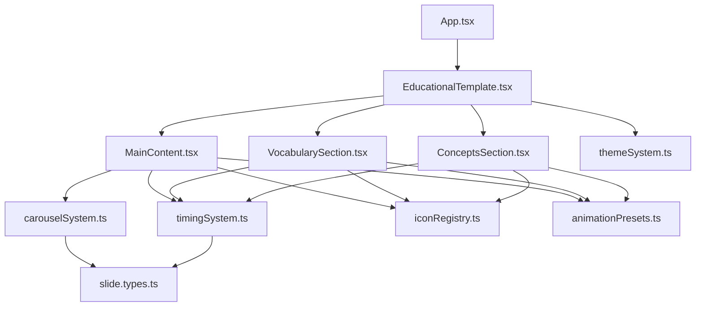

# 🏗️ **CURRENT ARCHITECTURE ANALYSIS**

> **STATUS**: Development PARALYZED - Architecture complexity has reached critical mass where AI agents cannot make changes safely.

## 📊 **SYSTEM OVERVIEW**

### **File Count & Distribution**
- **Total TypeScript Files**: 24 files
- **Framework Files**: 18 files (75% of codebase)
- **Application Files**: 6 files (25% of codebase)
- **Complexity Ratio**: 3:1 framework-to-application ratio indicates over-engineering

### **Directory Structure** 
```
src/ (24 files)
├── components/                     [1 file]
│   └── PresentationViewer.tsx
├── framework/                      [18 files - PROBLEM AREA]
│   ├── components/                 [5 files]
│   │   ├── sections/               [3 files]
│   │   │   ├── ConceptsSection.tsx
│   │   │   ├── MainContent.tsx     [520 lines - MASSIVE]
│   │   │   └── VocabularySection.tsx
│   │   └── templates/              [2 files]
│   │       ├── EducationalTemplate.tsx
│   │       └── index.ts
│   ├── types/                      [6 files]
│   │   ├── animation.types.ts
│   │   ├── index.ts
│   │   ├── presentation.types.ts
│   │   ├── slide.types.ts
│   │   ├── template.types.ts
│   │   └── theme.types.ts
│   └── utils/                      [5 files - DUAL SYSTEMS]
│       ├── animationPresets.ts     [324 lines]
│       ├── carouselSystem.ts       [172 lines]
│       ├── iconRegistry.ts         [173 lines]
│       ├── themeSystem.ts          [229 lines]
│       └── timingSystem.ts         [117 lines]
├── slides/                         [4 files]
│   └── configs/
└── [root]                          [1 file]
    ├── App.tsx
    └── main.tsx
```

## 🚨 **CRITICAL PROBLEMS IDENTIFIED**

### **Problem 1: Dual Animation Paradigms** 
**Severity**: 🔴 CRITICAL - Blocks all development

**The Issue**: Two completely separate animation systems operating simultaneously:

#### **System A: Duration-Based (carouselSystem.ts)**
```typescript
// Fixed intervals, duration-driven
const carousel = useMainContentCarousel({
  vocabularyItems,
  conceptItems,
  slideTiming,
  autoStart: shouldUseCarousel
});

// Drives main content with hardcoded 3-5 second intervals
```

#### **System B: Precise-Timing (timingSystem.ts)**  
```typescript
// Millisecond precision, startTime-driven  
const { isTimingHighlighted } = useTimingAnimation({
  elementId: 'title',
  timing: slideTiming?.title,
  isSlideActive
});

// Drives sidebar highlights with exact timing points
```

**Why This Is Broken**:
- ❌ **No Shared State**: Systems can drift out of sync
- ❌ **Duplicate Logic**: Similar timing logic implemented twice  
- ❌ **Maintenance Nightmare**: Changes require updating both systems
- ❌ **Testing Complexity**: Must test both systems independently AND together
- ❌ **Debugging Hell**: Issues could be in either system or their interaction

### **Problem 2: Framework Over-Abstraction**
**Severity**: 🟠 HIGH - Unnecessary complexity

```
Educational Template
    ↓
Template System
    ↓  
Section System (MainContent, VocabularySection, ConceptsSection)
    ↓
Component Framework
    ↓
Animation System + Timing System + Theme System + Icon System
```

**Analysis**: 
- **4 layers of abstraction** for what should be 2-3 simple components
- **Template system** adds no value - just passes props through
- **Section system** creates artificial boundaries
- **Framework components** could be plain React components

### **Problem 3: State Management Chaos**
**Severity**: 🟠 HIGH - Hard to debug and modify

**Current State Sources**:
1. **App.tsx**: View mode state, timing toggle state
2. **carouselSystem.ts**: Carousel state (currentSlide, progress, transitions)
3. **timingSystem.ts**: Timing highlights for each element
4. **VocabularySection.tsx**: Hover states, section hover states
5. **ConceptsSection.tsx**: Duplicate hover logic
6. **EducationalTemplate.tsx**: Hover container states

**Problems**:
- ❌ **No Single Source of Truth**: State scattered across 6+ locations
- ❌ **Prop Drilling**: State passed through multiple component layers
- ❌ **State Synchronization**: No guarantees different states stay in sync
- ❌ **Debugging Difficulty**: Hard to track which component owns what state

### **Problem 4: Utility Sprawl**
**Severity**: 🟡 MEDIUM - Maintenance burden

**Current Utilities** (5 separate systems):
- `animationPresets.ts` - 324 lines of animation configurations
- `carouselSystem.ts` - 172 lines carousel management
- `iconRegistry.ts` - 173 lines icon rendering system  
- `themeSystem.ts` - 229 lines theme configurations
- `timingSystem.ts` - 117 lines timing management

**Analysis**: Most functionality could be consolidated into 1-2 files.

## 🔄 **DEPENDENCY ANALYSIS**

### **Current Dependency Flow**


### **Circular Dependencies Detected** ⚠️
1. **Type Dependencies**: Multiple utils importing from shared `slide.types.ts`
2. **Component Dependencies**: Sections importing from multiple utils
3. **Implicit Dependencies**: Animation systems depend on each other through timing

### **High Coupling Points**
- **MainContent.tsx**: Imports from 4 different utility systems
- **timingSystem.ts**: Used by 3+ different components
- **slide.types.ts**: Referenced by 6+ files

## 📈 **COMPLEXITY METRICS**

### **Cyclomatic Complexity**
- **MainContent.tsx**: ~25 branches (carousel mode vs static mode)
- **carouselSystem.ts**: ~15 branches (slide type handling)
- **timingSystem.ts**: ~12 branches (timing state management)
- **Total System Complexity**: ~70+ decision points

### **Lines of Code Distribution**
```
MainContent.tsx:        520 lines (22% of codebase)
animationPresets.ts:    324 lines (14% of codebase) 
themeSystem.ts:         229 lines (10% of codebase)
Top 3 files = 46% of total code
```

### **Import Complexity**
Average file imports from 3-4 different modules, creating tight coupling.

## 🧠 **AI AGENT COMPREHENSION ANALYSIS**

### **Why AI Agents Struggle** 🤖❌

1. **Context Overflow**: 
   - Needs to understand 24 files to make any change
   - Single change affects multiple systems
   - No clear entry points or boundaries

2. **Dual System Confusion**:
   - AI can't determine which animation system to modify
   - Changes in one system may break the other
   - No documentation on system interaction

3. **State Uncertainty**:
   - Multiple sources of truth make AI unsure about state flow
   - Can't predict side effects of state changes
   - Unclear component ownership

4. **Framework Abstraction**:
   - Template system obscures actual rendering logic  
   - Section abstractions hide component relationships
   - AI spends cycles understanding framework instead of solving problems

### **Development Velocity Impact**
- **Simple Changes**: 4-6 hour tasks due to complexity navigation
- **Feature Addition**: Nearly impossible without breaking existing functionality
- **Bug Fixes**: Require understanding multiple interconnected systems
- **Refactoring**: Avoided due to risk of breaking working design

## 🎯 **REFACTORING PRIORITIES**

### **Priority 1: CRITICAL** 🔴
**Unify Animation Systems**
- Single animation hook replacing dual paradigms
- Unified timing configuration  
- Single source of truth for all animations

### **Priority 2: HIGH** 🟠  
**Flatten Component Hierarchy**
- Remove template abstractions
- Consolidate section components
- Direct component relationships

### **Priority 3: HIGH** 🟠
**Centralize State Management**  
- Single state context
- Eliminate prop drilling
- Clear state ownership

### **Priority 4: MEDIUM** 🟡
**Consolidate Utilities**
- Merge related utility functions
- Reduce import complexity
- Simplify dependency graph

## 📊 **REFACTORING SUCCESS METRICS**

### **Target Architecture** 
- **File Count**: 24 → 12 files (50% reduction)
- **Animation Systems**: 2 → 1 unified system
- **State Contexts**: Multiple → 1 centralized context
- **Utility Files**: 5 → 1-2 consolidated files
- **Import Complexity**: 3-4 avg → 1-2 avg imports per file

### **AI Comprehension Goals**
- ✅ AI can understand entire system in single context window
- ✅ Clear component boundaries and responsibilities  
- ✅ Single source of truth for state and animations
- ✅ Obvious entry points for modifications
- ✅ Predictable change impact scope

---

**⚠️ CONCLUSION**: Current architecture has reached critical complexity where development is effectively paralyzed. Refactoring is not optional - it's required to unblock development while preserving the working visual design.